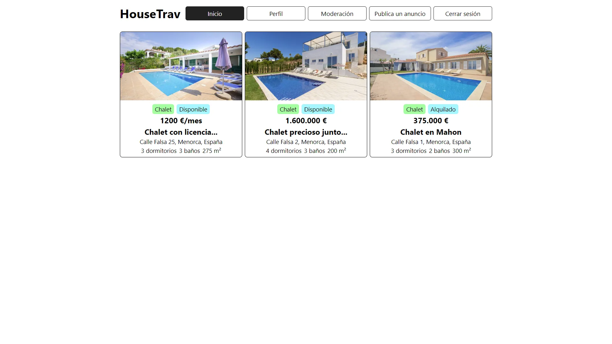

# HouseTrav Project | Frontend

El frontend del portal inmobiliario.

Para la parte backend clic [aquí](https://github.com/jaamdev/housetrav-backend-project).

[](https://housetrav-frontend-project-production.up.railway.app)
[](https://github.com/jaamdev/housetrav-frontend-project)

## Vista



## Tecnologías usadas


## Descripción

### Un portal inmobiliario en el cual puedes anunciar un chalet, apartamento, casa, edificio o terreno para vender o alquilar y con subida de imágenes para cada inmueble.

## Cómo usarlo

Se puede ver los inmuebles sin necesidad de crear una cuenta, pero para crear un anuncio hay que registrarse en su correspondiente formulario. Para ello se puede usar una dirección de correo electrónico inventada (_hola@example.com_) ya que no se valida por ser un proyecto de práctica.

Luego ir a _**"Publica un anuncio"**_ arriba a la derecha y rellena el formulario, no todos los valores son obligatorios. Envía el formulario y se notificará si hay algún campo sin rellenar que sea obligatorio para registrar el anuncio. Recuerda marcar la casilla _**"Cualquiera puede ver el anuncio"**_ para que el inmueble pueda ser visto por otros usuarios del portal.

Para añadir imágenes solo hay que ir al perfil del usuario y darle al botón de editar que tiene cada inmueble, luego darle al botón _**"Imágenes"**_. Imágenes de menos de 3mb y que sean de tipo **JPG** o **PNG**.

## Por qué lo hice

Suponía todo un reto la creación de un proyecto mucho más complejo de los habituales, y el aprendizaje de MySQL y la subida de archivos.

## Lo que aprendí

Con este proyecto me ayudó a comprender cómo de complejo puede llegar a ser un proyecto con tantos datos diferentes que manejar en la base de datos.

Aprendí ha hacer un CRUD en [MySQL](https://mysql.com) con la librería [MySQL2](https://github.com/sidorares/node-mysql2), sentencias básicas pero útiles en este tipo de base de datos.

Amplió mi conocimiento en [NodeJS](https://nodejs.org), y el aprendizaje y uso de las validaciones de datos con [Valibot](https://valibot.dev).

Refresqué mis conocimientos con el framework [Express](https://expressjs.com), [BCrypt](https://github.com/kelektiv/node.bcrypt.js) y el uso de tokens con Jason Web Token con la librería [Jose](https://github.com/panva/jose).

Y aprendí a usar la librería [Multer](https://github.com/expressjs/multer) para la subida de archivos de imágenes y junto con la librería [Sharp](https://sharp.pixelplumbing.com) para optimizar imágenes.

## Documentación

### Vídeos

|          Nombre | Vídeo                                                                                                 |
| --------------: | :---------------------------------------------------------------------------------------------------- |
|   Leifer Mendez | [Imágenes con Multer](https://youtu.be/DahdecVt3cM)                                                   |
| Garaje de Ideas | [Imágenes con Multer](https://youtu.be/nRZE3It4B-E)                                                   |
|         Midudev | [Curso SQL](https://youtube.com/playlist?list=PLUofhDIg_38qg8LANkItqY-0sYw7CTDui&si=CT9PfcitHUUiliPV) |

### Info

|       Nombre | Info                                                                                   |
| -----------: | :------------------------------------------------------------------------------------- |
|      ReactJS | [https://react.dev](https://react.dev)                                                 |
| React Router | [https://github.com/remix-run/react-router](https://github.com/remix-run/react-router) |
|         Vite | [https://vitejs.dev](https://vitejs.dev)                                               |

## Instalación

1. Clonar el repositorio

```bash
git clone https://github.com/jaamdev/housetrav-frontend-project.git
```

2. Instalar las dependencias

```bash
npm install
```

3. Iniciar servidor de desarrollo

- Importante configurar las variables de entorno

```bash
npm run dev
```

## Variables del entorno

### VITE_API_URL

Esta variable se debe configurar con la URL donde esté la parte backend.

Ejemplo: `VITE_API_URL="http://localhost:4000"`
